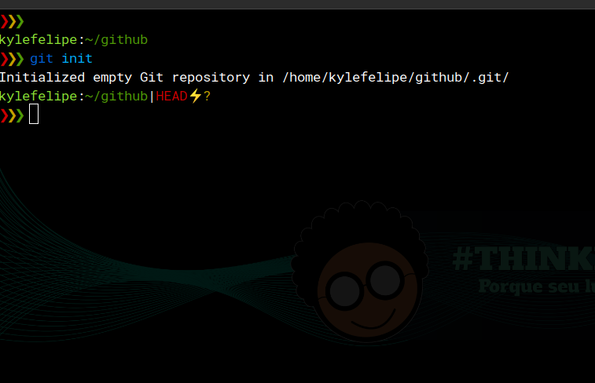
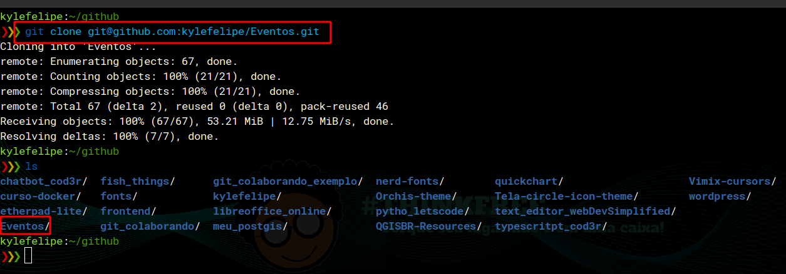
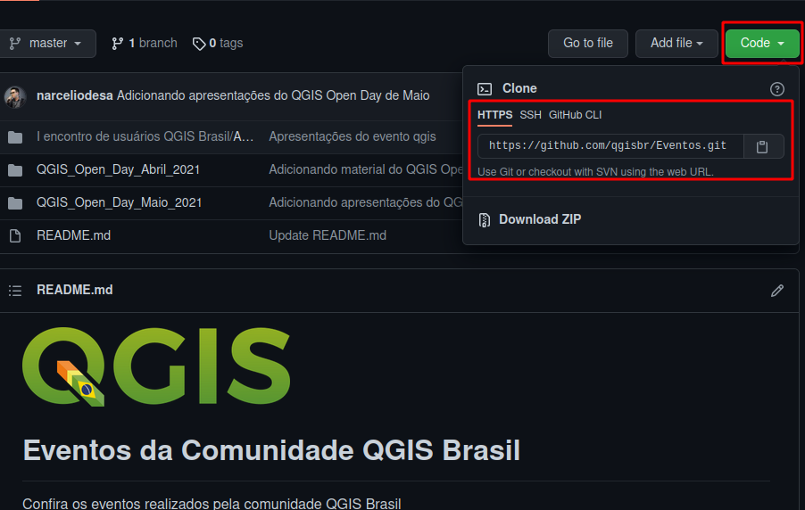
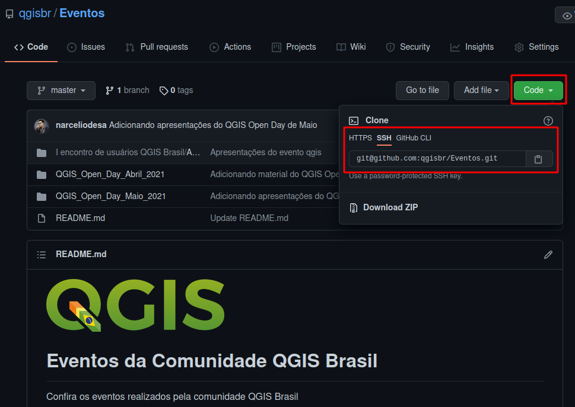
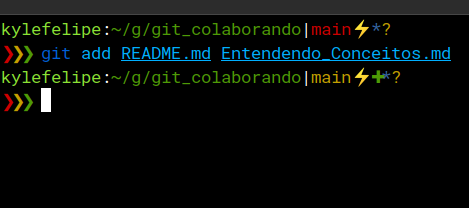
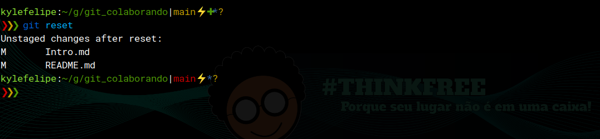
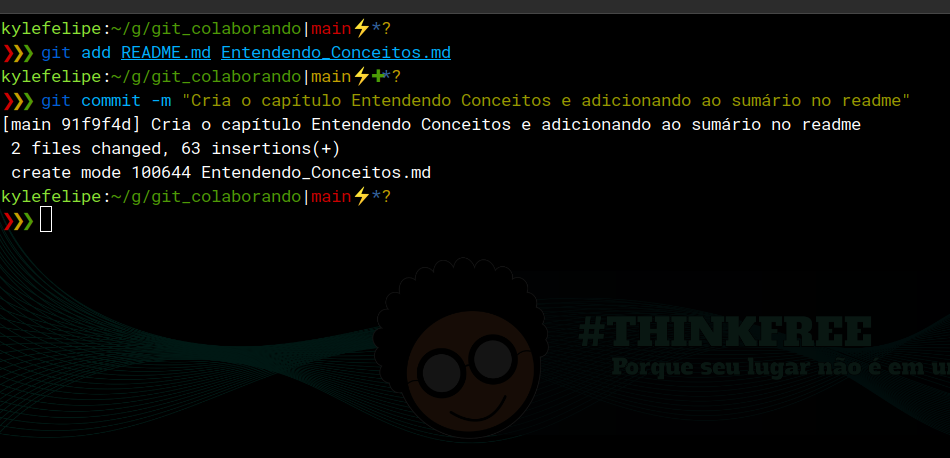
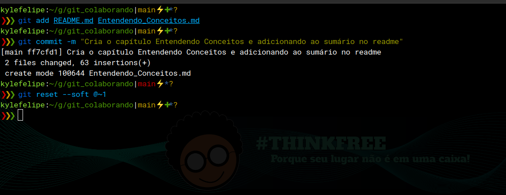
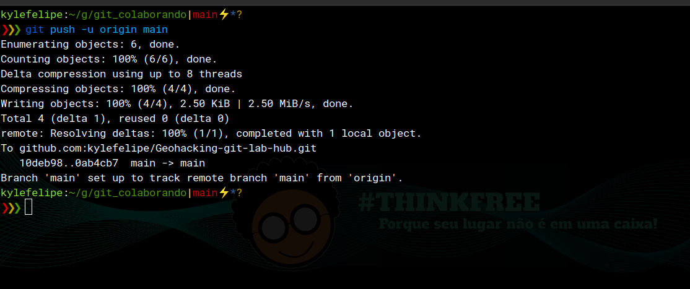
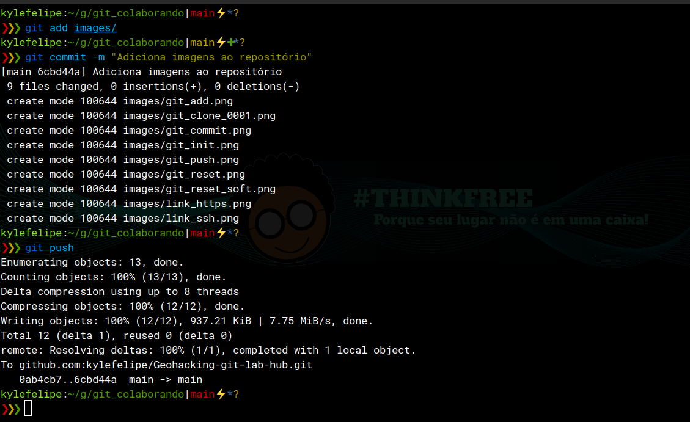

# Comandos básicos

O Git possui MUITOS comandos, alguns deles eu nunca ví serem usados de perto. Mas nesse mundo de versionamento, quem nunca ouviu falar de clone, commit, pull e push?

Normalmente usamos a ferramenta no terminal, através do comando `git <comando>...`.  
E aqui estão os comandos.

## Git Init

Quando estamos começando um projeto do zero, temos de iniciar o git na pasta onde iremos trabalhar. e para isso usamos o comando `git init`



## Git Clone

Esse comando é o responsável por copiar o repositório para a máquina que queremos trabalhar. Por padrão ele cria uma pasta com o nome do repositório que estamos clonando e coloca os dados lá dentro.

exemplo:

```bash
# Usando HTTPS para acessar o repositório
git clone https://github.com/kylefelipe/Eventos.git
# ou
# Usando ssh para acessar o repositório
git clone git@github.com:kylefelipe/Eventos.git
```



Os links para clonagem do repositório podem ser obtidos na pagina dos mesmos.

Link HTTPS:  
  

Link SSH:  


## Git Add

O git add é o inicio da preparação para o commit, pois é com ele que a gente adiciona um ou mais arquivos ao commit, que é feito logo em seguida.

```bash
# O atalho . adiciona todos os arquivos alterados para o commit
git add .

# ou adicionando os arquivos desejados.

git add <arquivo1>  <arquivo2> ... <arquivoN>

```



É possível remover os arquivos adicionados nesse momento usando o comando `git reset`, o comando mantém as alterações nos arquivos.

```bash
# Remove todos os arquivos adicionados

git reset

# Remove apenas os arquivos desejados

git reset <nome_do_arquivo>

```



## Git Commit

O commit, é aqui que dizemos oque fizemos, em poucas palavras, usando a opção -m podemos passar a mensagem que quisermos entre aspas ou aspas dulas, assim, todas as modificações que fizemos anteriormente são 'agrupadas' em uma mesma descrição.

```bash
git commit -m "Mensagem de commit"

```

Após o commit é mostrado um resumo do que foi adicionado.



Também é possível desfazer um commit usando o `git reset`.

```bash
# A opção --soft mantém as edições nos arquivos
git reset --soft HEAD~1
# ou 
git reset --soft @~1
```

o número após o `~` indica a quantidade de commits que deseja desfazer. No exemplo acima, só desfaz o último commit.



## Git Push

Com o comando `git Push` é possível enviar as modificações para o nosso fork ou outro repositório remoto que temos no projeto.  
Podemos definir um repositorio remoto padrão e uma brach padrão para sempre enviar as alterações para lá ao fazermos o pull, pois podemos ter mais de um repositório remoto em um mesmo projeto. Por padrão, o repositório de onde foi feito o fork do projeto é chamado de `origin` mas esse nome pode ser mudado.

```bash
# A opção -u marca um remoto e branch como padrão
git push -u <remoto> <branch>
# Exemplo
git push -u origin main
```



Com a opção `-u` as próximas vezes que enviar alterações a partir dessa branch, basta utilizar `git push` apenas.



[⬅️ Voltar](./Fluxo_de_contribuicao.md)
